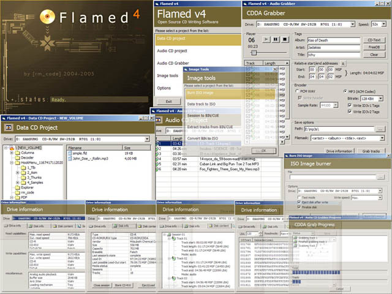



## Flamed Lib \- CD Writing and more

### Description

The Flamed Lib (or simply Flamed v4) is an Active X DLL with plenty of functions for you to deal with CD/DVD-ROM programming.

Comes with a complete CD Burner application and many little test projects.

Features: create Data CDs (multisession) and Audio CDs, burn ISO images, data track to ISO image, session to BIN/CUE, extract tracks from BIN/CUE images, BIN to ISO conversion,

audio tracks to WAV/MP3 (uses the ACM), CD-Text reader, FreeDB query, drive/disk/disk content information,

CD player (digital/analog), CD-RW eraser, drive monitor (fires if medium removed/arrived) and more.

The drive compatibility was increased once more,

you shouldn't get the "Could not send write parameters page" error anymore.

For any other questions read "readme.txt".
 
### More Info
 
Windows 98/Me users: make sure you have an ASPI layer

Windows NT/2K/XP users: you must have administrator rigths or an ASPI layer

Flamed will not intentionaly create coasters

or damage your CD-Rs in any other way!

             |
---                |---
**Submitted On**   |2005-07-31 22:09:50
**By**             |[Arne Elster](https://github.com/Planet-Source-Code/PSCIndex/blob/master/ByAuthor/arne-elster.md)
**Level**          |Advanced
**User Rating**    |4.9 (299 globes from 61 users)
**Compatibility**  |VB 6\.0
**Category**       |[Complete Applications](https://github.com/Planet-Source-Code/PSCIndex/blob/master/ByCategory/complete-applications__1-27.md)
**World**          |[Visual Basic](https://github.com/Planet-Source-Code/PSCIndex/blob/master/ByWorld/visual-basic.md)
**Archive File**   |[Flamed\_Lib191964812005\.zip](https://github.com/Planet-Source-Code/arne-elster-flamed-lib-cd-writing-and-more__1-62011/archive/master.zip)

